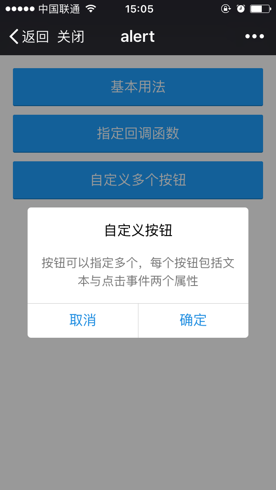
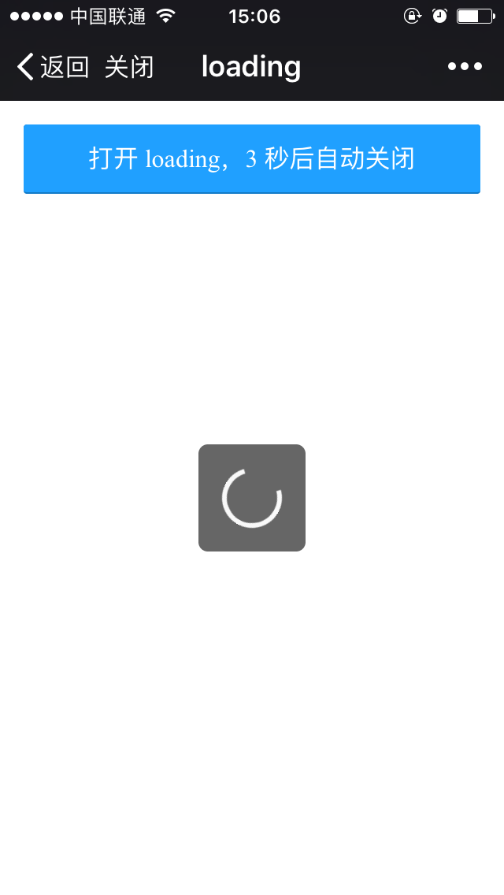
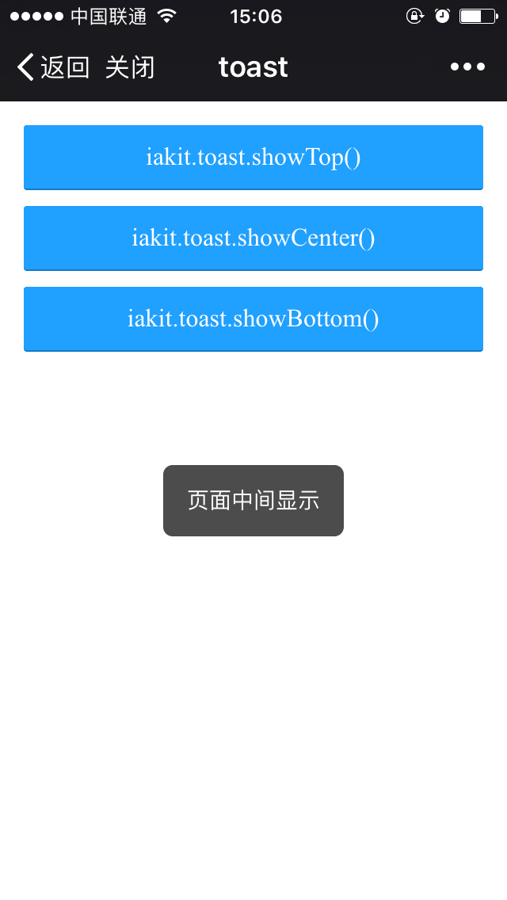

# iakit

无依赖 mini 组件库，只封装了 alert, toast, loading, actionSheet 等使用频率较高的组件。适用于类似 H5 活动页的简单移动端项目，不必为了使用这些组件而引入一个大而全的 UI 库和框架。

<table>
  <tbody>
    <tr>
      <td align="center" valign="top">
        <p>iakit.alert</p>
        
      </td>
      <td align="center" valign="top">
        <p>iakit.loading</p>
        
      </td>
      <td align="center" valign="top">
        <p>iakit.actionSheet</p>
        
      </td>
      <td align="center" valign="top">
        <p>iakit.toast</p>
        
      </td>
    </tr>
  </tbody>
</table>

## Usage

使用 yarn/npm 安装，以模块化方式引入

```
$ yarn add iakit
```

```js
import * as iakit from 'iakit'
import 'iakit/dist/style.css'

iakit.alert('提示', '测试测试测试测试')
iakit.loading.show()
iakit.actionsheet({/* 你的选项 */})
iakit.toast.showTop('测试测试测试')
```

也可以直接引入文件，比如使用 CDN

```html
<link rel="stylesheet" href="https://unpkg.com/iakit@2.1.0/dist/style.css">
<script src="https://unpkg.com/iakit@2.1.0/dist/index.js"></script>

<script>
  iakit.alert('提示', '测试测试测试测试')
  iakit.loading.show()
  iakit.actionsheet({/* 你的选项 */})
  iakit.toast.showTop('测试测试测试')
</script>
```

## API

### `iakit.alert(title, content, buttons)`

* title: `string`，可选
* content: `string`，必选
* buttons: `array` | `function`，可选（button 结构：{ text: String, onClick: Function }）

```js
import * as iakit from 'iakit'

// demo 1.
iakit.alert('注册失败', '该邮箱已经被注册，如果有您有任何疑问请咨询客服。')

// demo 2.
iakit.alert(
  '注册失败',
  '该邮箱已经被注册，如果有您有任何疑问请咨询客服。',
  [
    { text: '取消', onClick: () => {} },
    { text: '确定', onClick: () => {} }
  ]
)
```

##### 自定义选项

* `z-index`：在页面有其他元素的使用了定位并且层级比较高时可以使用这个参数调整 alert 的层级
* `btnText`: 默认按钮的文案是 “确定”，可以通过这个参数修改

```js
iakit.alert.config({
  zIndex: 9999, // alert 的 z-index
  btnText: 'ok' // 默认按钮的文案
})
```

### `iakit.toast.showTop(content, time, callback)`

* content: `string` 必选
* time: `number` 显示多少毫秒，可选，默认 1500
* callback: `function` toast 消失后的回调，可选

```js
import * as iakit from 'iakit'

// demo 1.
iakit.toast.showTop('注册成功')

// demo 2.
iakit.toast.showCenter('注册成功', 5000)

// demo 3.
iakit.toast.showBottom('注册成功', () => {
  // do something you want
})
```


### `iakit.loading.show()`

```js
import * as iakit from 'iakit'

iakit.loading.show()

setTimeout(() => {
  iakit.oading.hide()
}, 3000)
```

### `iakit.actionsheet(options)`

#### options:
* title: `string`，可选
* options: `array` 可以操作的选项，必选（option 结构：{ text: String, disable: Boolean, onClick: Function }）
* destructiveIndex：`number` 危险选项的 index， 可选

```js
import * as iakit from 'iakit'

iakit.actionsheet({
  options: [
    {
      text: '我再想想',
      disable: false,
      onClick: (i, text) => {}
    },
    {
      text: '去它的(disabled)',
      disable: true
    },
    {
      text: '就这样吧',
      onClick: (i, text) => {
      }
    }
  ],
  destructiveIndex: 2,
  title: '确认要分手吗？',
  onClick(i, text) {
    // 点击了没有指定 onClick 函数的选项时，执行这个函数
  },
  onCancel() {
    // 取消了
  }
})
```

## License
MIT
